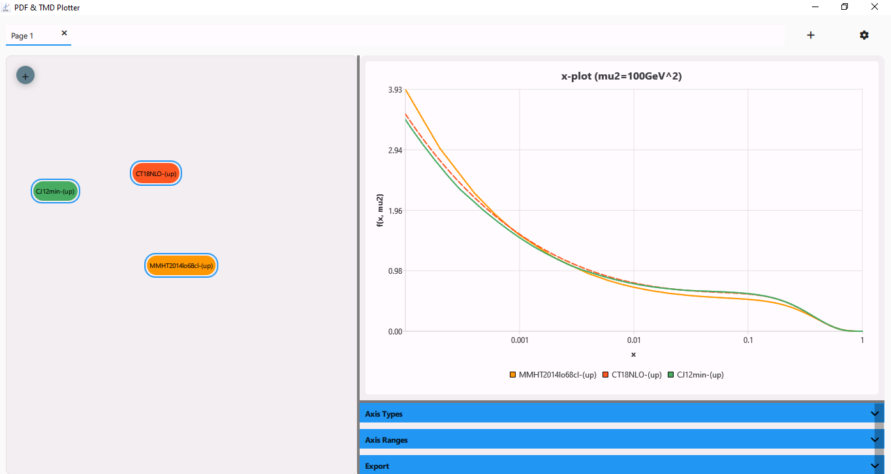
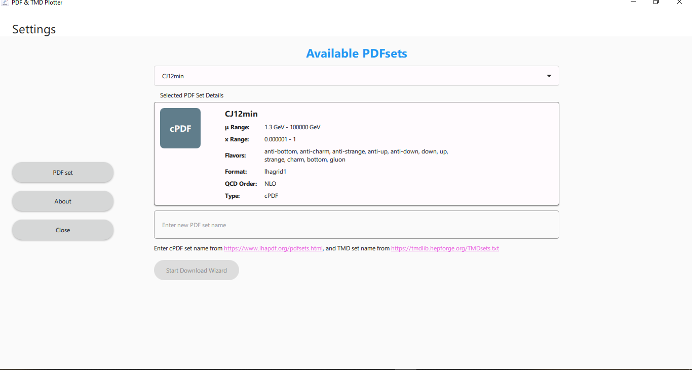
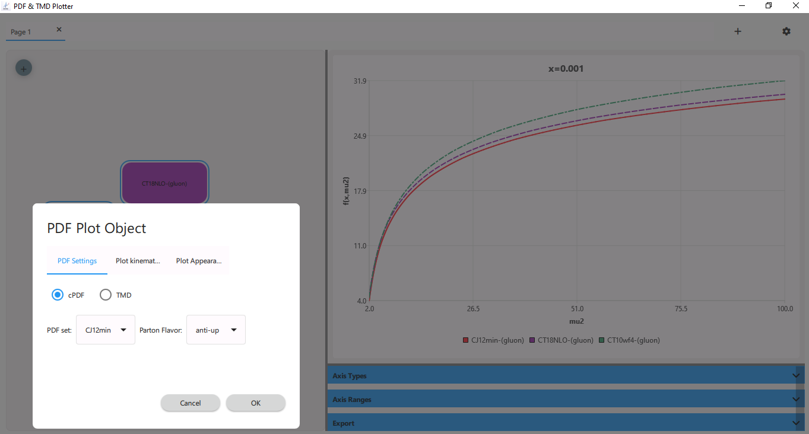

# QtPDFxTMDPlotter

A Qt-based application for plotting and visualizing PDF (Parton Distribution Function) and TMD (Transverse Momentum Distribution) data. This tool allows users to interactively explore, compare, and export various types of parton distribution functions.

## Screenshots

Here are some screenshots showing the main features of the application:

### Main Plot Interface

*Interactive visualization of different PDF sets with customizable plots*

### Settings Dialog

*Configure and download PDF and TMD sets from LHAPDF and TMDLIB repositories*

### PDF Configuration

*Detailed configuration options for each PDF plot object*

## Features

- Interactive PDF and TMD data visualization
- Support for various plot types (X, Mu2, Kt2)
- Multiple plot tabs for easy comparison
- Customizable line styles and colors
- Data export capabilities
- User-friendly interface with Material Design
- Easy access to LHAPDF and TMDLIB repositories

## Requirements

- Qt 6.x
- C++17 or higher
- CMake 3.16 or higher

## Building the Project

1. Make sure you have Qt and CMake installed
2. Clone the repository:
   ```
   git clone https://github.com/Raminkord92/QtPDFxTMDPlotter.git
   cd QtPDFxTMDPlotter
   ```
3. Configure and build with CMake:
   ```
   cmake -B build
   cmake --build build
   ```

## Usage

The application provides an intuitive interface for plotting various PDFs and TMDs:

1. Use the tabs to work with multiple plots simultaneously
2. Configure plot parameters using the settings dialog
3. Customize visualization with different line styles and colors
4. Export plots in various formats
5. Download PDF and TMD sets directly within the application

## Contributing

Contributions are welcome! If you are interested in contributing, please don't hesitate to contact me at [raminkord92@gmail.com](mailto:raminkord92@gmail.com).

## License

This project is licensed under the Creative Commons Attribution 4.0 International License. For more details, please see the [LICENSE](LICENSE.txt) file.

## Contact

For any inquiries, please contact [raminkord92@gmail.com](mailto:raminkord92@gmail.com).
